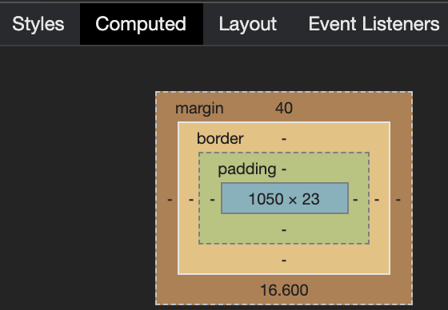
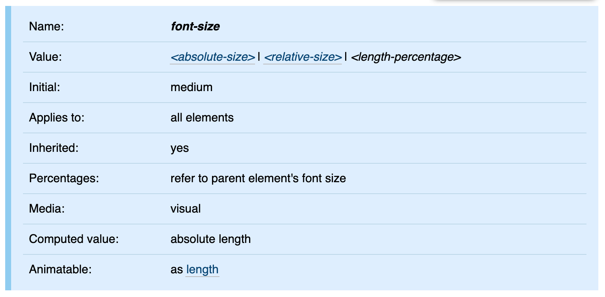
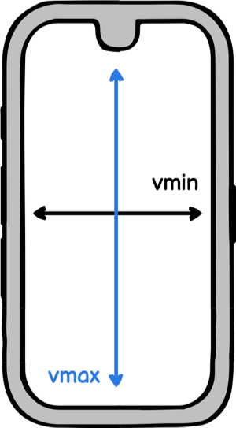
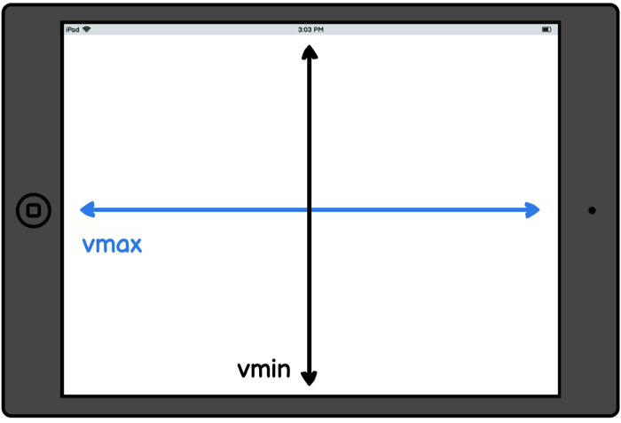
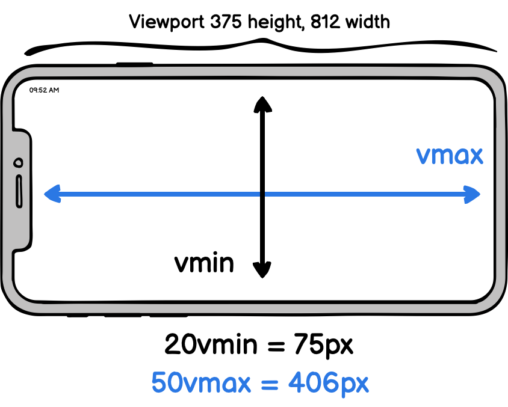

## Agenda

- Relative units
- Font-relative units (`em`, `rem`)
- Percentage units (`%`)
- Viewport units (`vw`, `vh`, `vmin`, `vmax`)
- Common use cases

---

## What are relative CSS units?

- [absolute length units](https://developer.mozilla.org/en-US/docs/Learn/CSS/Building_blocks/Values_and_units#Absolute_length_units) (e.g., `px`) well known
- [relative length units](https://developer.mozilla.org/en-US/docs/Learn/CSS/Building_blocks/Values_and_units#Relative_length_units) specify length relative to something else, not absolutely
    - [font-relative length units](https://developer.mozilla.org/en-US/docs/Web/CSS/length#Font-relative_lengths) (e.g.,  `em`, `rem`)
    - [relative to the viewport](https://developer.mozilla.org/en-US/docs/Web/CSS/length#Viewport-percentage_lengths) (e.g., `vw`, `vh`)
- Enable fluid layouts and foster web accessibility (who rely on zooming)

---

## Related data types

- percentage (`%`) common data type in the context of relative units
- Some CSS properties accept integer values (unitless values), e.g., `line-height`

---

# Font-relative units

---


## Font-relative units

- `em`: relative to the font-size of the current element
- `rem`: relative to the font-size of the root `html` element
- Key factor: inheritance and context for calculation
- Also see: [Font-relative length units on MDN](https://developer.mozilla.org/en-US/docs/Web/CSS/length#Font-relative_lengths)

---

## Unit `em`

- Browser converts `em` to `px` based on the element's font size
- Example: `2em` on `20px` font-size = `40px`
- Nested elements accumulate the `em` context

---

## Unit `em` (2)

- See live: [CodePen - CSS Unit em - Headings](https://codepen.io/doppelmutzi/pen/xqbyZb)
- The rendered margin value of `h2` is `40px`
- What's the margin value of `h3`?


---

## Unit `em` (3)

- The rendered margin value of `h3` is `46.8px`! Why? 
- `h3` has default value (Browser default): `1.17em` 
- `font-size` derived from `body` element: `16px`
- calculation: `1.17em * 16px = 18.72px * 2.5em = 46.8px`

---

## Unit `rem`

- `rem` stands for "root em", always relative to `html` element's  font-size (usually `16px` for desktop browsers)
- Calculation: Multiply the `rem` value by the actual font-size value in `px` of the `html` element.
- Example: `2rem` = `32px` if `html` has `16px`font size
- See live: [CodePen - CSS Unit rem](https://codepen.io/doppelmutzi/pen/NpqXpR)

---

## Using `em` - Caveats

- `font-size` is always inherited from the HTML parent hierarchy
- good to check [CSS reference](https://www.w3.org/TR/css-fonts-3/#propdef-font-size) for finding out


---

## Using `em` - Caveats (2)

- Font settings impact all `em`-based values (crucial for a11y and RWD)
- Nested `em` usage can lead to escalated sizes (e.g., with lists)
- See live: [CodePen - problematic em inheritance](https://codepen.io/doppelmutzi/pen/aJOzJR)

---

## Using `em` - Caveats (3)

- The font-size for level 1 `li` is `14px`: 1.4 (li selector) * 10px (inherited font-size from body)
- The `font-size` for level 2 `li` is `19.6px`: 1.4 (li selector) * 14px (inherited from level 1 li)
- The `font-size` for level 3 `li` is even bigger at `27.44px`:  1.4 (li selector) * 19.6px (inherited from level 2 li)

---

## Solving nesting problem - approach 1

- To ensures all `li` elements have the same font size, you could add another selector:

```css
li li { 
    font-size: 1em; 
};
```

---

## Solving nesting problem - approach 2

- Use `rem` instead
- No unwanted inheritance effects
- See live: [CodePen - CSS Unit rem - no inheritance effects](https://codepen.io/doppelmutzi/pen/yMNBKr)

---

## Working with `rem`

1) No `px` value for `html` defined: `px` value is inherited from browser settings or browser default values
2) `font-size` of `html` defined as `px`: this is used for calculation


---

## Working with `rem` (2)

3) `font-size` of `html` defined as`em` or `%`: `px` value is calculated based on the browser's font settings or default values
4) `font-size` of `html` defined as `rem`: `px` value of `html` is the result of multiplication with the browser font size settings or default values

---

## When to use `rem`

- Use `rem` for unified sizing without `font-size` inheritance
- `rem` responds to user font settings
    - When a user increases font size, you can retain the integrity of the layout
    - e.g., text does not get squeezed into a small container of fixed width

---

## When to use `em`

- `em` enables proportional, component-based scaling within a context
- Great to determine “sizing values” (e.g., `margin`, `width`) depending on `font-size` values of parent
- Establish proportional relationships between design elements within a context 
- Improves reusability by adjusting relationships solely by parent's `font-size`
- See live: [CodePen - Responsive buttons with em unit](https://codepen.io/doppelmutzi/pen/BbNbpy)


---

# Relative CSS units

---

## Percentage (`%`)

- See: [MDN - percentage](https://developer.mozilla.org/en-US/docs/Web/CSS/percentage)
- not a length unit per se but a CSS data type
- Used everywhere where length values (e.g., `em`) are applicable
- always refers to a fraction of the parent
- A length defined in `%` is based on the length (computed value in `px`) of the same property of the parent

---

## Percentage example

```css
  /* example % styles */
  main {
    width: 400px;
    height: 50%;
  }
  
  h1 {
      width: 50%;
  }
````
```html
<!-- HTML / markup -->
<body>
  <main>
    <h1>hello world</h1>
  </main>
</body>
```

---

## Percentage example (2)

- computed `width` of `h1` is half of its parent (`main`): `200px`
- computed `height` of `main` 
    - if parent container is `body`, then `%` always refers to viewport size
    - computed value of `main` element’s `height` property is half the height of the computed value of the viewport container

---

# Viewport units

---


## viewport width (`vw`) and viewport height (`vh`)

- [Viewport units](https://www.w3.org/TR/css3-values/#viewport-relative-lengths) represent a percentage of the current browser viewport
- `1vw` is 1% of viewport’s width; `1vh` is 1% of viewport’s height
- `100vw` is 100% of viewport’s width; `100vh` is 100% of viewport’s height
- No cascading or parent influence (unlike `%`): viewport units always relate to browser viewport


---


## Main use case

- top-level containers that should occupy space relative to viewport
- full-width sections `100vw` caveat
    - beware horizontal scrollbar!
    - `border` and `margin` aren't considered in width calculation
- See demo: [CodePen - Viewport units demo](https://codepen.io/doppelmutzi/pen/MWjGQgd)


---


## Full-width sections

- Can be solved by setting `box-sizing` to `border-box`
- Can prevent overflow by using `calc()` to subtract border widths/margins
- Sometimes `width: 100%` with `display: block` better choice


---


## Using `vh` vs `%` for height

- use `vh` to stretch a container to viewport height
- `%` for height only works with fixed layout techniques to ensure the parent container fills viewport height
- good practice for sticky footer: `flexbox` with `vh`
- See demo: [CodePen - sticky footer with flexbox](https://codepen.io/doppelmutzi/pen/bqNoBK)


---

## `vmin` and `vmax`

- associated units are `vmin` and `vmax`
- `20vmin` relates to `20vw` or `20vh`, whichever is smaller
- `10vmax` relates to `10vw` or `10vh`, whichever is larger
- `vmin` and `vmax` are fluid units responding to screen orientation and size

---

## portrait orientation

- `10vmin` resolves to `10%` of `vw` in portrait mode



---

## landscape orientation

- `10vmin` resolves to `10%` of `vh` in landscape mode


---

## `vmin` and `vmax` example



---


# Common use cases

---


## Local and global scaling

- Combine `em` and `rem` for truly flexible, inclusive designs
    - `rem` for global scaling (whole website)
    - `em` for scaling on module level
- Reacts to user font-size settings for accessibility
- See demo: [CodePen by Chris Coyier – Em AND Rem](https://codepen.io/chriscoyier/pen/tvheK)

---


## break-out sections

- Full-width containers in limited-width parents
    - Useful for layouts in CMS or restricted containers
- Children can "break out" to span entire horizontal space using `vw`
- See demo: [CodePen – Full-width containers in limited-width parents](https://codepen.io/doppelmutzi/pen/abmMWgY)

---


## Break-out sections (2)

- Key CSS pattern for break-out sections
```css
 .break-out {
    // 500px because of the max width of the container
    margin-left: calc(-100vw / 2 + 500px / 2);
    // replace 500px with 100%
    margin-left: calc(-50vw + 50%);
}
```

---

## Custom scroll indicator with `vh`

- Combine percentage (`%`) and `vh` units for a pure CSS scroll indicator
- Useful for creating modern scroll progress bars or effects
- See demo: [CodePen – CSS only scroll indicator](https://codepen.io/MadeByMike/pen/ZOrEmr)
